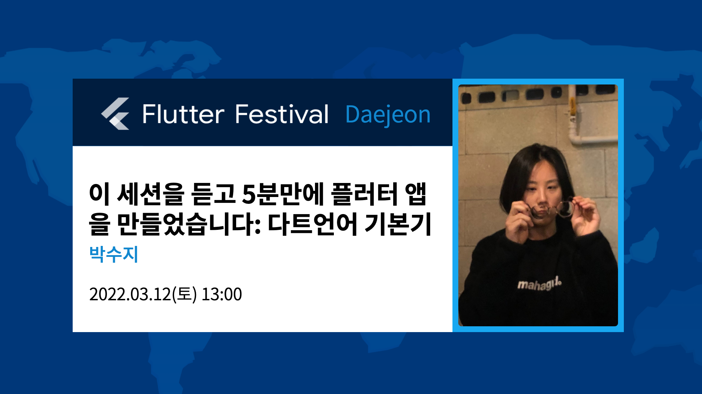

# dart_hands_on

2022 Flutter Festival: GDG Daejeon



## 세션 개요

### 🚩 Flutter 입문자를 대상으로 진행되는 다트 언어 핸즈온 세션입니다.

다트는 클래스 기반의 객체 지향 컴파일 언어입니다. 다트의 문법 스타일은 C 언어와 거의 유사하며 Java, C#, JavaScript 에서의 기능적 스트럭쳐를 추가해 보다 간결하고 강력한 기능을 지원하고있어, 관련 언어 경험이 있으신 분들은 더욱 친숙하게 접해보실 수 있습니다.

### 🚩 오늘의 할 일을 추가하고 수정, 삭제하는 투두 프로그램을 작성해보면서 플러터를 구현하기 위해 알아야할 다트의 핵심 문법 기본기를 빠르게 학습하고 활용해봅니다.

- 타입 별 변수, 상수 선언과 컨벤션
- 클래스 작성과 사용
- 함수 작성과 호출
- 열거형 `enum` 과 `extension method` 활용
- 고차함수 `map()`, `where()`, `toList()`
- control flow `if`, `switch`
- Type Casting

## 세션 환경 구성

### 👉 플러터 환경 구성이 완료된 상태라면

```shell
$ git clone https://github.com/macaronpark/dart-hands-on.git
```

`dart-hands-on/lib/dart_hands_on.dart` 에서 코드를 함께 작성합니다.
flutter run with chrome 으로 브라우저 콘솔에서 프로그램 상태를 확인하며 진행됩니다.

### 👉 플러터 환경 구성이 되어있지 않은 상태라면

https://dart.dev/#try-dart 로 접속해 별도의 환경 구성없이 브라우저에서 아래 코드를 붙여넣기하여 진행하실 수 있습니다.

```Dart
// 📌 `Todo` class
//
// tip 1. 멤버 변수: 고유 아이디, 할 일 제목, 완료 여부, 생성 일시
// tip 2. `late` modifier
// tip 3. 상수 `final` vs. `const`
// tip 4. 클래스 생성자 with syntactic sugar

// 📌 `FieldNames` enum
//
// tip 1. enum { 케이스, 케이스, }

// 📌 `FieldNamesExtension` extension
//
// tip 1. extention 익스텐션명 on 대상 {}

void main() {
  // GDG Daejeon Flutter Festival
  // Session 1. <이 세션을 듣고 5분만에 플러터 앱을 만들었습니다: 다트 언어 기본기> - suzy
  //
  //
  // 🐦 목표: 오늘의 할 일을 추가하고 수정, 삭제하는 프로그램을 작성합니다.

  // 📌 투두 목록을 저장할 배열이 필요합니다.
  //
  // tip 1. 변수 `var` vs. `type annotation`
  // tip 2. `List` class
  // tip 3. https://github.com/flutter/flutter/wiki/Style-guide-for-Flutter-repo#avoid-using-var-and-dynamic

  // 📌 오늘의 할 일을 추가하려고 합니다. 먼저 투두 클래스를 만들어주세요.

  // 📌 두 개의 새 투두를 만들어주세요.
  //
  // - id: 1, title: "다트 핸즈온 세션 듣기"
  // - id: 2, title: "플러터 핸즈온 세션 듣기"

  // 📌 새로운 투두를 기존의 투두 목록에 추가하는 함수 `addTodos(:newTodos)` 를 작성해주세요.
  //
  // tip 1. 반환값 함수명(인자) {}
  // tip 2. Named parameters

  // 📌 `addTodo(:newTodo)` 를 사용하여 투두를 목록에 추가해주세요.

  // 📌 투두 목록 내 특정 투두의 정보를 수정하는 함수
  //    `updateTodo(:id :fieldName :newValue)` 를 작성해주세요.
  //
  // tip 1. 인자 fieldName 은 Enumerated types `FieldNames` 를 사용해 휴먼에러를 방지해주세요.
  // tip 2. 인자 newValue 의 타입은 String 또는 bool 이어야 합니다.
  // tip 3. `dynamic` vs `Object`
  // tip 4. type casting

  // 📌 `updateTodo(:id :fieldName :newValue)` 를 사용하여
  //    고유 아이디 1번 투두의 제목을 "new title!" 로 변경해주세요.

  // 📌 투두 목록 내 특정 투두를 삭제하는 함수 `deleteTodo(:id)` 를 작성해주세요.
  //
  // tip 1. where, toList

  // 📌 `deleteTodo(:id)` 를 사용하여 고유 아이디 1번 투두를 삭제해주세요.

}
```

## 참고

- [flutter.dev: Install Flutter](https://docs.flutter.dev/get-started/install)
- [dart.dev: Language Tour](https://dart.dev/guides/language/language-tour)
